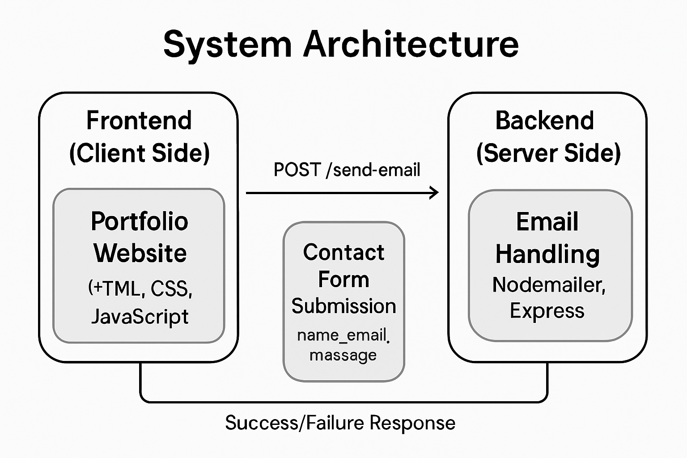
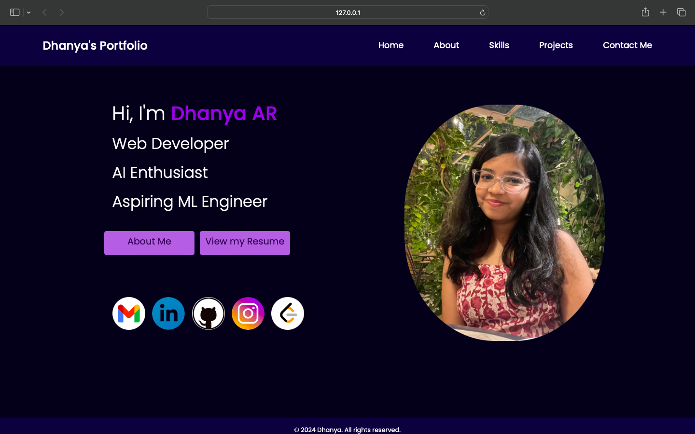
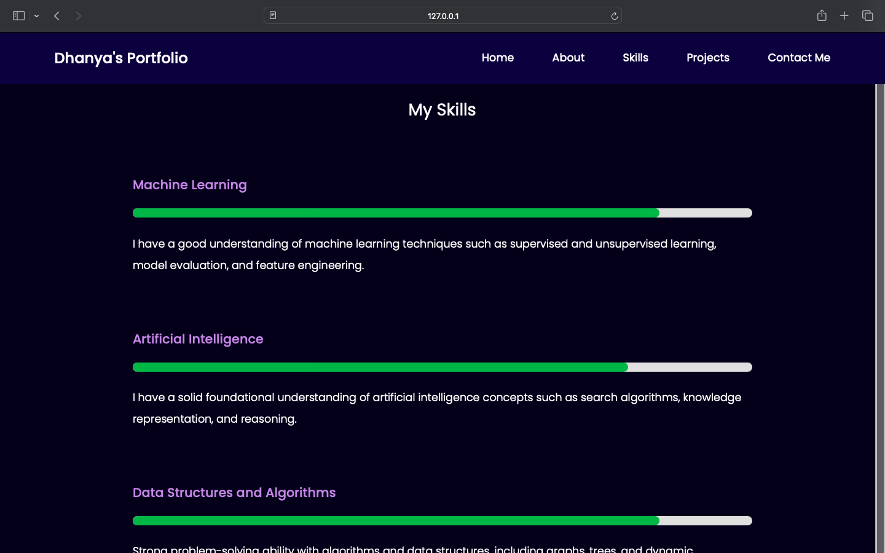
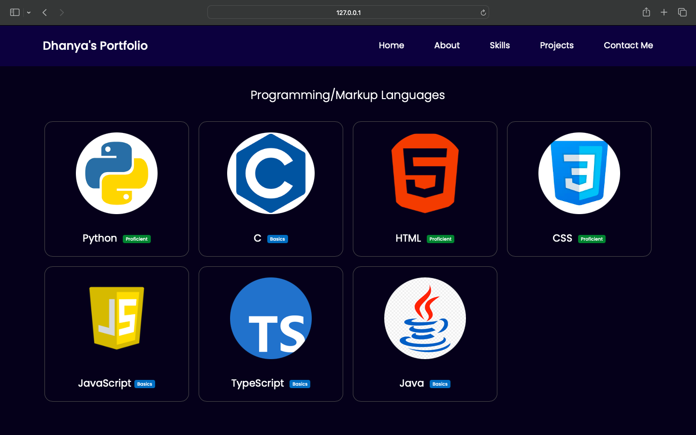
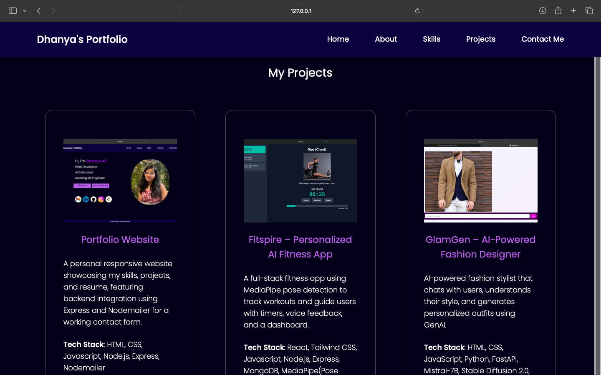
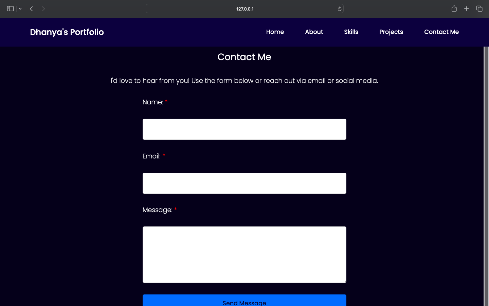

# Dhanya A R – Personal Portfolio Website

A fully responsive, multi-page portfolio website crafted to showcase my projects, technical skills, and journey as an aspiring AI/ML Engineer. Built entirely from scratch — no templates — it blends clean front-end design with real-world backend logic, featuring Express.js integration and a fully functional contact form powered by Nodemailer.

This portfolio isn’t just a site — it’s a snapshot of my passion, precision, and readiness to build impactful tech.


## 🚀 Demo

#### 🎞️ Instant Preview  
A quick visual tour of my portfolio website — showcasing the clean UI, smooth transitions, and responsive layout across key sections like Home, Skills, and Projects.


#### 📺 Full Walkthrough  
Prefer a more detailed look?  
Check out the full walkthrough video covering all pages and design decisions here:  
[▶️ Watch on YouTube](https://www.youtube.com/watch?v=YOUR_VIDEO_ID)

> 📌 **Note:** Personal photo has been excluded in the public version for privacy. You can view it in the demo video.


## ✨ Key Features

- 👋 Personalized Home Page – A clean, responsive introduction that shares who I am, my career goals, and quick access buttons to view my resume or navigate through the site.
- 📄 Resume Access – A direct link to my resume is provided on the home page for quick viewing.
- 🔗 Social Links Integration – Prominent icons link directly to my active profiles on Gmail, LinkedIn, GitHub, Instagram, and LeetCode for easy connection.
- 🧑‍💻 About Page Overview – Summarizes my academic background, technical interests, and programming journey in a concise, story-driven format.
- 📊 Skill Progress Bars – Displays key domains like ML, AI, web development and databases, each with a visual progress bar and short description of my current proficiency.
- 💡 Passion to Purpose Section – A personal narrative on how I discovered AI/ML and what drives me in this field, adding a human element to the portfolio.
- 🧰 Skills Page with Proficiency Badges – Divided into Programming Languages, Frameworks/Toolkits, and Python Libraries — each tool is presented with an icon, name, and colored badge (Proficient, Basics, Exploring) that reflects my current confidence level.
- 🖼️ Projects Showcase – Interactive project cards feature a live screenshot, concise description, tech stack, and clickable links that open the GitHub repo in a new tab — making it easy to explore real work.
- 📬 Working Contact Form with Email Integration – A functional contact form that sends messages directly to my inbox using Express.js and Nodemailer — showcasing full-stack capability.
- 🧩 Multi-Page Layout – Separate, well-organized pages for Home, About, Skills, Projects, and Contact — connected through a smooth and intuitive navigation bar.
- 📱 Fully Responsive Design – Seamlessly adapts across desktops, tablets, and mobile devices using modern HTML/CSS practices — carefully tuned for accessibility and user experience.
- 🎨 Handcrafted from Scratch – No templates, no boilerplate. Every section was manually coded using HTML, CSS, and vanilla JavaScript — demonstrating raw frontend design and backend integration skills.


## 🛠️ Tech Stack

- Frontend: HTML, CSS, JavaScript 
- Backend: Node.js, Express.js 
- Email Integration: Nodemailer


## 🧩 System Architecture

The architecture follows a simple client-server model, showcasing both frontend craftsmanship and backend integration:

- 📄 Frontend (Client Side)
     - Entire site is built with HTML, CSS, and JavaScript.
     - Each page - Home, About, Skills, Projects, Contact - is statically rendered and fully responsive.
     - All interactions are handled on the client, except for form submission.
      
- 📨 Contact Form Submission (Client → Server)
     - On the Contact page, the user submits a message via a form.
     - This triggers a POST request to an Express.js server route (/send-email).
     - Data (name, email, message) is validated and sent using Nodemailer to my Gmail inbox.
     - A success/failure response is returned to the frontend.
      
- 📤 Email Handling (Server Side)
     - The Express backend processes the request and securely sends the email via Nodemailer.
     - No database is involved, making the backend lightweight and purpose-driven.
      
This minimal yet complete architecture highlights how frontend and backend can communicate seamlessly, even in a primarily static portfolio.


## 🛠️ System Flow Diagram




## ⚙️ Setup Instructions

Follow these steps to run the project locally:
   
1. Clone the repository:
```
git clone https://github.com/DhanyaAR/portfolio-website.git
cd your-repo-name
```

2. Install server-side dependencies
```
npm install
```

3. Create a `.env` file

In the root directory, create a `.env` file with the following variables:
```
EMAIL_USER=your_email@example.com
EMAIL_PASS=your_app_password
TO_EMAIL=your_email@example.com
```
⚠️ Note: Never upload your .env file to GitHub. These values are used securely by Nodemailer to send emails.

4. Start the backend server
```
node server.js
```
The backend uses Express.js to handle contact form submissions via Nodemailer.

5. Launch the frontend
   
Open index.html using a Live Server extension (such as in VS Code) or simply open it manually in your browser.


## 🖼️ Sample Screenshots

#### 🏠 Home Page: 
A responsive landing page offering a quick yet meaningful introduction to who I am, with quick access to my resume and social links through intuitive icons.



#### 👩‍🎓 About Page: 
Showcases my academic background, skill progress bar, and the motivation behind choosing AI/ML.



#### 🛠️ Skills Page: 
Highlights my tech stack, organized by categories, with intuitive icons and badges that indicate proficiency levels.



#### 📁 Projects Page: 
Interactive cards with screenshots, brief descriptions, and tech stack — each linked to its GitHub repo.



#### 📬 Contact Page: 
Fully functional contact form powered by Node.js, Express, and Nodemailer — lets users message me directly.




## 🚀 Future Improvements

- Deploy the Portfolio – Host the project on platforms like Vercel or Netlify for broader accessibility and easy sharing.
- Add Dark Mode Toggle – Implement a user-friendly dark/light theme toggle for visual customization.
- Add Analytics – Integrate basic analytics (e.g., Google Analytics) to track visitor activity and improve content strategy.
- Project Demos – Embed short GIFs or videos for each project to offer a more interactive preview beyond screenshots.
- ReCAPTCHA Integration – Add Google reCAPTCHA to prevent spam through the contact form.
- UI Enhancements – Improve animations, transitions, and hover effects.
- Downloadable Resume PDF – Add a download button to allow direct access to the resume instead of viewing only.
- Interactive Tech Stack Icons – On hover, show tooltip with short description or fade-in animation explaining the tool’s use in your projects.


## 👩‍💻 Author

**Dhanya A R** – @dhanyaar29

*Aspiring AI/ML Engineer passionate about building meaningful digital experiences.*


